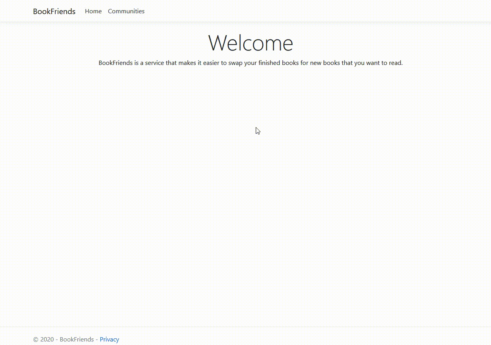
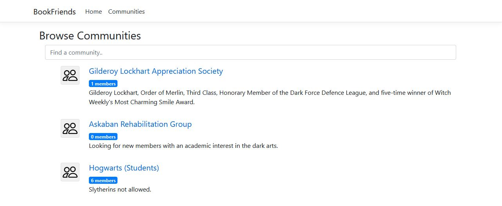
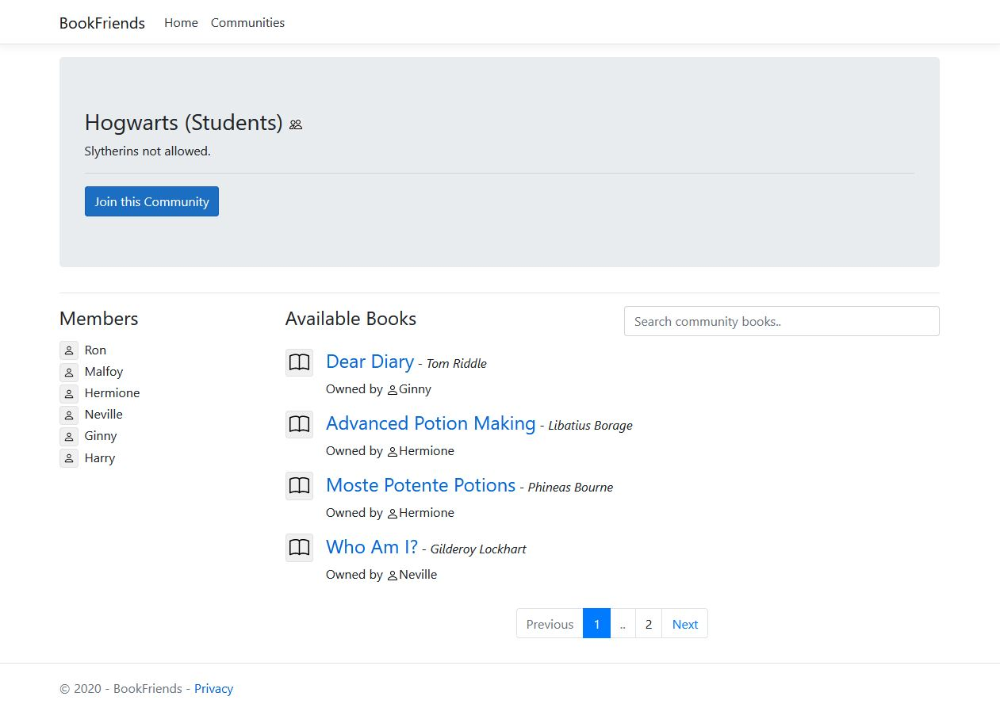

# BookFriends

Prototype for a web based book swapping platform. Created with ASP.NET MVC Core, Entity Framework, Vue.js, Bootstrap, NUnit and Moq.

## Preview

Demonstration of database querying, pagination and search filtering using levenstein distance comparison.

## Screenshots

